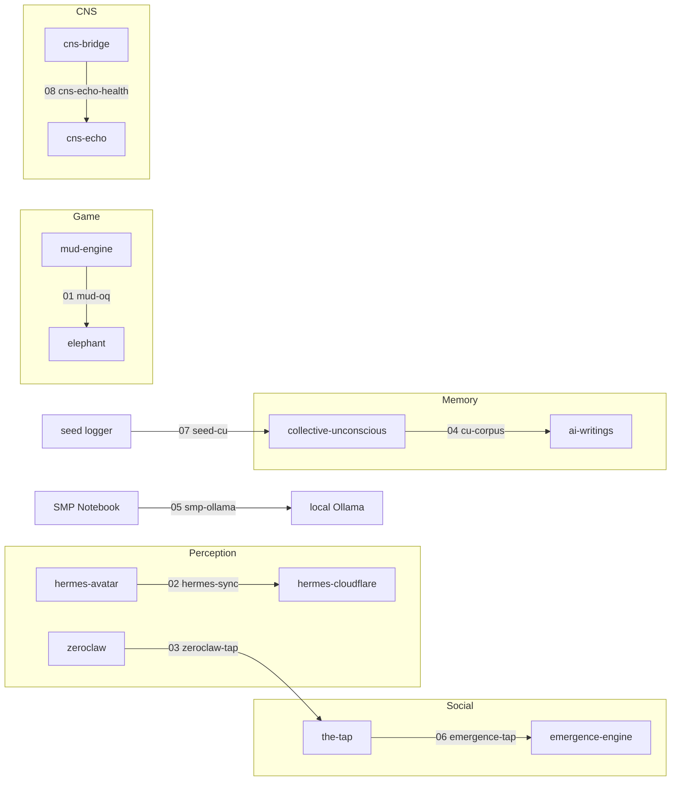

# 🔗 Fleet Connections — Integration Keel

> *The keel runs the length of the ship — invisible when intact, catastrophic when broken.*

Seven TypeScript connection modules wiring the SuperInstance fleet's repos into one running system. Each module translates types and protocols between two or more repos, turning 32 isolated codebases into a single vessel.

**Repo:** [SuperInstance/fleet-connections](https://github.com/SuperInstance/fleet-connections)
**Created:** August 9, 2026

---

## What This Is

Each repo in the fleet speaks its own dialect. [mud-engine](https://github.com/SuperInstance/mud-engine) has `World` and `Room`. [elephant](https://github.com/SuperInstance/elephant) has `RoomId` and `ROOMS`. [hermes-avatar](https://github.com/SuperInstance/hermes-avatar) emits `ReferenceFrame`s. [hermes-cloudflare](https://github.com/SuperInstance/hermes-cloudflare) stores them in D1. The types don't match. The protocols don't agree. The repos can't import each other.

Fleet Connections is the translation layer. Seven wires. Seven bridges. Seven nerves carrying signal between otherwise isolated systems.

---

## Connection Modules

| # | Module | Connection | What It Does |
|---|--------|------------|--------------|
| 01 | [`mud-oq`](./src/connections/01-mud-oq.ts) | [mud-engine](https://github.com/SuperInstance/mud-engine) ↔ [elephant](https://github.com/SuperInstance/elephant) | Loads OQ's 12 rooms into a mud-engine `World` instance |
| 02 | [`hermes-sync`](./src/connections/02-hermes-sync.ts) | [hermes-avatar](https://github.com/SuperInstance/hermes-avatar) ↔ [hermes-cloudflare](https://github.com/SuperInstance/hermes-cloudflare) | Converts `ReferenceFrame`s to D1 storage format |
| 03 | [`zeroclaw-tap`](./src/connections/03-zeroclaw-tap.ts) | [zeroclaw](https://github.com/SuperInstance/zeroclaw-dissertation) ↔ [the-tap](https://github.com/SuperInstance/the-tap) | Posts ZeroClaw outputs to The Tap as conversation lines |
| 04 | [`cu-corpus`](./src/connections/04-cu-corpus.ts) | [collective-unconscious](https://github.com/SuperInstance/collective-unconscious) ↔ [ai-writings](https://github.com/SuperInstance/AI-Writings) | Parses markdown writings into embedding-ready chunks |
| 05 | [`smp-ollama`](./src/connections/05-smp-ollama.ts) | [SMP Notebook](https://github.com/SuperInstance/AI-Writings) ↔ local Ollama | Creates probe cells for local model experimentation |
| 06 | [`emergence-tap`](./src/connections/06-emergence-tap.ts) | [the-tap](https://github.com/SuperInstance/the-tap) ↔ [emergence-engine](https://github.com/SuperInstance/emergence-engine) | Converts Tap messages into group dynamics events |
| 07 | [`seed-cu`](./src/connections/07-seed-cu.ts) | Seed logger ↔ [collective-unconscious](https://github.com/SuperInstance/collective-unconscious) | Logs and embeds agent state seeds |
| 08 | [`cns-echo-health`](./src/connections/08-cns-echo-health.ts) | [cns-bridge](https://github.com/SuperInstance/cns-bridge) ↔ [cns-echo](https://github.com/SuperInstance/cns-echo) | Analyzes bus traffic health, provides telemetry summaries |

### The Keel at a Glance



---

## The Full Fleet Loop

```
1. Hermes captures a frame (hermes-avatar)
       │
2. Frame synced to cloud (hermes-cloudflare via hermes-sync)
       │
3. Notable observation posted to The Tap (zeroclaw-tap)
       │
4. NPCs react in the Tap room (the-tap)
       │
5. Conversation chunked and embedded (cu-corpus → collective-unconscious)
       │
6. Emergence detector notices the pattern (emergence-tap)
       │
7. Seed logger records the agent's post-interaction state (seed-cu)
       │
8. State changes reflected in MUD rooms (mud-oq)
       │
9. SMP notebook probes local models for insight (smp-ollama)
       │
10. CNS echo-health checks signal health on the bus (cns-echo-health)
       │
      └──► back to perception
```

---

## Integration Tests

Five test suites verify cross-repo contracts using **real source code** from both sides:

| # | Test | Repos Verified |
|---|------|----------------|
| 01 | [`cns-bridge-the-tap`](./tests/01-cns-bridge-the-tap.test.ts) | [cns-bridge](https://github.com/SuperInstance/cns-bridge) ↔ [the-tap](https://github.com/SuperInstance/the-tap) |
| 02 | [`mud-engine-spatial-registry`](./tests/02-mud-engine-spatial-registry.test.ts) | [mud-engine](https://github.com/SuperInstance/mud-engine) ↔ [spatial-registry](https://github.com/SuperInstance/spatial-registry) |
| 03 | [`hermes-collective-unconscious`](./tests/03-hermes-collective-unconscious.test.ts) | [hermes-cloudflare](https://github.com/SuperInstance/hermes-cloudflare) ↔ [collective-unconscious](https://github.com/SuperInstance/collective-unconscious) |
| 04 | [`officers-quarters-smp-notebook`](./tests/04-officers-quarters-smp-notebook.test.ts) | [elephant](https://github.com/SuperInstance/elephant) ↔ SMP notebook |
| 05 | [`scummvm-arcade-platos-shell`](./tests/05-scummvm-arcade-platos-shell.test.ts) | [scummvm-arcade](https://github.com/SuperInstance/scummvm-arcade) ↔ [platos-shell](https://github.com/SuperInstance/platos-shell) |

---

## Development

```bash
npm install
npm test           # Run all integration tests
npm run build      # TypeScript compile
```

**Stack:** TypeScript ES2022 · Vitest · Zero runtime dependencies

---

## Fleet Connections

The keel doesn't float on its own — it holds the hull together:

- **Room engine:** [mud-engine](https://github.com/SuperInstance/mud-engine) — the core MUD
- **Perception:** [hermes-avatar](https://github.com/SuperInstance/hermes-avatar) — sensory systems
- **Cognition:** [cns-bridge](https://github.com/SuperInstance/cns-bridge) — the CNS bus
- **Memory:** [collective-unconscious](https://github.com/SuperInstance/collective-unconscious) — shared substrate
- **Social:** [the-tap](https://github.com/SuperInstance/the-tap) — the agentic bar
- **Creative:** [ai-writings](https://github.com/SuperInstance/AI-Writings) — the corpus
- **Emergence:** [emergence-engine](https://github.com/SuperInstance/emergence-engine) — pattern detection
- **Knowledge:** [lucineer-fleet-wiki](https://github.com/SuperInstance/lucineer-fleet-wiki) — D1-backed wiki
- **Dashboard:** [cocapn-dashboard](https://github.com/SuperInstance/cocapn-dashboard) — fleet monitor
- **Events:** [fleet-envelope](https://github.com/SuperInstance/fleet-envelope) — event grammar
- **Spatial:** [spatial-registry](https://github.com/SuperInstance/spatial-registry) — room topology
- **Mirror:** [zeroclaw](https://github.com/SuperInstance/zeroclaw-dissertation) — the dark mirror
- **Shell:** [platos-shell](https://github.com/SuperInstance/platos-shell) — the shell pattern
- **Game:** [elephant](https://github.com/SuperInstance/elephant) — Phaser client
- **Arcade:** [scummvm-arcade](https://github.com/SuperInstance/scummvm-arcade) — web arcade

---

## The CNS Bus Connection

Connections ARE the bridge. Where [cns-bridge](https://github.com/SuperInstance/cns-bridge) defines the protocol, fleet-connections implements the wiring. The CNS bus is the nervous system; these modules are the nerves.

---

## Design Principles

1. **Type translation, not type invention.** Each module maps existing types from repo A to existing types in repo B. No new abstractions.
2. **Inline when necessary.** Cross-repo TypeScript imports can't resolve at test time, so source types are mirrored inline with comments pointing to their origin.
3. **Integration tests use real source.** Tests import actual code from both repos being connected — no mocks of the repos themselves.
4. **Zero runtime dependencies.** The only deps are `typescript` and `vitest` (dev only).

---

## Quick Start

```bash
git clone https://github.com/SuperInstance/fleet-connections.git
cd fleet-connections
npm install
npm test           # Run all integration tests
npm run test:full-loop  # Full-loop integration test
npm run build      # TypeScript compile
```

### Using a Connection Module

```typescript
import { mudOqBridge } from './src/connections/01-mud-oq';
import { hermesSync } from './src/connections/02-hermes-sync';

// Load OQ rooms into mud-engine World
const world = mudOqBridge.loadRooms(oqRooms);

// Sync hermes frames to D1
await hermesSync.sync(frames, db);
```

---

## Testing

Five test suites verify cross-repo contracts using **real source code** from both sides. No mocks of the repos themselves — only standard test isolation.

```bash
npm test                    # All tests
npm run test:full-loop      # Full integration loop
```

Tests cover:
- Type compatibility (mud-engine types ↔ OQ types)
- Data transformation correctness (frames → D1 rows)
- Event propagation (Tap messages → emergence events)
- End-to-end loop (perception → sync → post → react → embed → detect → record)

---

## Configuration

### Dependencies

**Zero runtime dependencies.** The only deps are dev:

| Package | Purpose |
|---------|---------|
| [TypeScript](https://www.typescriptlang.org/) | Type checking |
| [Vitest](https://vitest.dev/) | Test runner |

### Design Principles

1. **Type translation, not type invention** — each module maps existing types from repo A to repo B. No new abstractions.
2. **Inline when necessary** — cross-repo TypeScript imports can't resolve at test time, so source types are mirrored inline.
3. **Integration tests use real source** — tests import actual code from both repos being connected.
4. **Zero runtime dependencies** — the only deps are `typescript` and `vitest` (dev only).

---

## Further Reading

### For Developers

- [Adapter Pattern (Wikipedia)](https://en.wikipedia.org/wiki/Adapter_pattern) — what each connection module is
- [Bridge Pattern (Wikipedia)](https://en.wikipedia.org/wiki/Bridge_pattern) — the structural pattern used
- [Facade Pattern (Wikipedia)](https://en.wikipedia.org/wiki/Facade_pattern) — simplifying cross-repo access
- [Integration Testing (Wikipedia)](https://en.wikipedia.org/wiki/Integration_testing) — what the test suites verify
- [Contract Testing (Wikipedia)](https://en.wikipedia.org/wiki/Contract_testing) — consumer-driven contracts

### For Architects

- [Service Integration Patterns](https://www.enterpriseintegrationpatterns.com/) — enterprise integration patterns
- [Coupling vs Cohesion](https://en.wikipedia.org/wiki/Coupling_(computer_programming)) — the trade-off each module navigates
- [Anti-Corruption Layer](https://learn.microsoft.com/en-us/azure/architecture/patterns/anti-corruption-layer) — preventing domain pollution
- [API Gateway Pattern](https://microservices.io/patterns/apigateway.html) — where fleet-gateway fits
- [Event-Driven Architecture](https://en.wikipedia.org/wiki/Event-driven_architecture) — the fleet-envelope connection

### For Systems Engineers

- [Distributed Systems (Wikipedia)](https://en.wikipedia.org/wiki/Distributed_computing) — what the fleet IS
- [Fallacies of Distributed Computing](https://en.wikipedia.org/wiki/Fallacies_of_distributed_computing) — what to watch for
- [CAP Theorem (Wikipedia)](https://en.wikipedia.org/wiki/CAP_theorem) — consistency vs availability trade-offs
- [Byzantine Fault Tolerance](https://en.wikipedia.org/wiki/Byzantine_fault) — multi-agent trust

---

## License

MIT · Built by Casey DiGennaro & the SuperInstance Fleet
